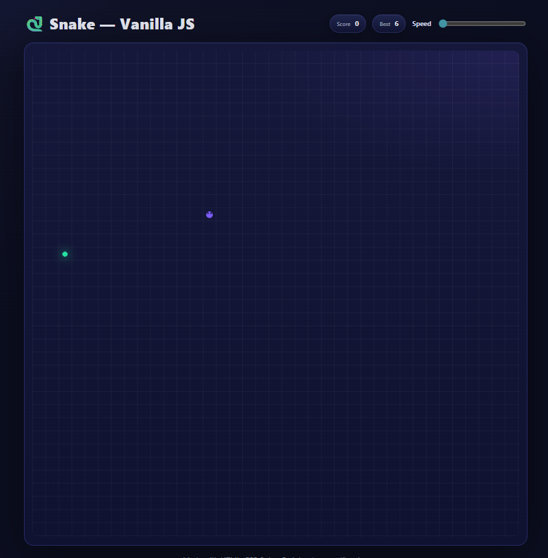

# 🐍 Snake Game — Vanilla HTML/CSS/JS

A modern take on the classic Snake game built using **only HTML, CSS, and JavaScript** — no libraries or frameworks. 🚀

## ✨ Features

* 🎨 Sleek UI with glowing effects
* ⌨️ Keyboard controls (WASD / Arrow keys)
* 📱 Touch controls (swipe + on‑screen D‑pad)
* ⏸️ Pause/Resume support (Space key)
* 🔄 Restart anytime (R key)
* 🏆 Local high score saved in `localStorage`
* ⚡ Adjustable speed slider
* 🍎 Apples with glowing animation
* Responsive canvas with crisp rendering

## 🎮 Controls

* **Move:** Arrow Keys / WASD / Swipe / On‑screen D‑pad
* **Pause/Resume:** Spacebar
* **Restart:** R

## 🛠️ Setup

Just clone the repo and open the HTML file in your browser:

```bash
# Clone repository
git clone https://github.com/your-username/snake-game.git

# Open project
cd snake-game
open index.html   # or double-click in file explorer
```

No dependencies required! 🎉

## 🎥 Demo

Here’s a gameplay demo:

<video src="snake_game_preview.mp4" width="600" controls></video>

If the video above doesn’t load, click the image below 👇

[](snake_game_preview.mp4)

## 📸 Preview


## 🤝 Contributing

Pull requests are welcome! For major changes, please open an issue first to discuss what you’d like to change.

## 📜 License

This project is licensed under the MIT License. ✅
